# 🏥 Diagrama de Classes - Sistema de Gestão de Leitos
## Versão 2.0 - Modelo Completo Implementado

## Diagrama Completo (FHIR-Compliant)

```mermaid
classDiagram
    %% Paciente - Entidade Central
    class Patient {
        +String id (UUID)
        +String name
        +String documentNumber (CPF único)
        +Date birthDate
        +String phone
        +String emergencyContact
        +String emergencyPhone
        +RiskColor riskColor
        +String chiefComplaint
        +VitalSigns vitalSigns
        +String[] allergies
        +Boolean active
        +Date createdAt
        +Date updatedAt
        +calculateAge()
        +updateRiskColor(color)
    }

    %% Classificação de Risco Manchester
    class RiskColor {
        <<enumeration>>
        VERMELHO
        LARANJA
        AMARELO
        VERDE
        AZUL
    }

    %% Localização (Leitos e Hierarquia)
    class Location {
        +String id (UUID)
        +String alias (único)
        +String name
        +String description
        +LocationStatus status
        +LocationType type
        +String specialty
        +String floor
        +String building
        +String parentId
        +Location parent
        +Number capacity
        +Object metadata
        +Date createdAt
        +Date updatedAt
        +updateStatus(newStatus)
        +getHierarchyPath()
        +isAvailable()
        +isBed()
    }

    %% Tipos de Localização
    class LocationType {
        <<enumeration>>
        LEITO
        ALA
        ANDAR
        BLOCO
        UNIDADE
    }

    %% Status de Localização
    class LocationStatus {
        <<enumeration>>
        DISPONIVEL
        OCUPADO
        OCUPADO_AUSENTE
        HIGIENIZACAO_NECESSARIA
        HIGIENIZACAO_EM_ANDAMENTO
        MANUTENCAO
        BLOQUEADO
    }

    %% Internação/Atendimento
    class Encounter {
        +String id (UUID)
        +String patientId
        +Patient patient
        +String locationId
        +Location location
        +String responsibleDoctorId
        +User responsibleDoctor
        +EncounterStatus status
        +DateTime startDateTime
        +DateTime estimatedDischargeDate
        +DateTime actualDischargeDate
        +String dischargeReason
        +String diagnosis
        +String treatmentPlan
        +Note[] notes
        +Date createdAt
        +Date updatedAt
        +setEDD(date, reason, userId)
        +discharge(reason, userId)
        +addNote(content, userId, userName)
        +updateStatus(newStatus)
        +calculateStayDuration()
    }

    %% Status de Internação
    class EncounterStatus {
        <<enumeration>>
        EM_TRIAGEM
        AGUARDANDO_LEITO
        EM_ATENDIMENTO
        EM_MEDICACAO
        EM_EXAME
        AGUARDANDO_VISITA
        PREVISAO_ALTA
        ALTA_CONFIRMADA
        ALTA_REALIZADA
        TRANSFERIDO
        CANCELADO
    }

    %% Notas de Evolução
    class Note {
        +DateTime timestamp
        +String authorId
        +String authorName
        +String content
    }

    %% Tarefas (Limpeza, Medicação, Exames, etc)
    class Task {
        +String id (UUID)
        +TaskType type
        +TaskPriority priority
        +TaskStatus status
        +String encounterId
        +Encounter encounter
        +String locationId
        +Location location
        +String assignedToId
        +User assignedTo
        +String requestedById
        +User requestedBy
        +String description
        +DateTime scheduledFor
        +DateTime acceptedAt
        +DateTime startedAt
        +DateTime completedAt
        +ChecklistItem[] checklist
        +Object metadata
        +Date createdAt
        +Date updatedAt
        +accept(userId)
        +start()
        +complete()
        +calculateSLA()
        +isOverdue()
    }

    %% Tipos de Tarefa
    class TaskType {
        <<enumeration>>
        LIMPEZA
        LIMPEZA_EMERGENCIA
        MANUTENCAO
        TRANSPORTE
        MEDICACAO
        EXAME
        VISITA_MEDICA
    }

    %% Prioridades de Tarefa
    class TaskPriority {
        <<enumeration>>
        BAIXA
        NORMAL
        ALTA
        URGENTE
        CRITICA
    }

    %% Status de Tarefa
    class TaskStatus {
        <<enumeration>>
        SOLICITADA
        ACEITA
        EM_ANDAMENTO
        CONCLUIDA
        CANCELADA
    }

    %% Item de Checklist
    class ChecklistItem {
        +String item
        +Boolean completed
        +DateTime timestamp
    }

    %% Administração de Medicamentos
    class MedicationAdministration {
        +String id (UUID)
        +String encounterId
        +Encounter encounter
        +String patientId
        +Patient patient
        +String medicationName
        +String dosage
        +String route
        +String frequency
        +MedicationStatus status
        +DateTime scheduledDateTime
        +DateTime effectiveDateTime
        +String administeredById
        +User administeredBy
        +String notes
        +Date createdAt
        +Date updatedAt
        +administer(userId)
        +isPending()
        +isOverdue()
    }

    %% Status de Medicação
    class MedicationStatus {
        <<enumeration>>
        PLANEJADO
        EM_ANDAMENTO
        CONCLUIDO
        CANCELADO
    }

    %% Solicitação de Exames/Procedimentos
    class ServiceRequest {
        +String id (UUID)
        +String encounterId
        +Encounter encounter
        +String patientId
        +Patient patient
        +String requestType
        +ServiceRequestPriority priority
        +ServiceRequestStatus status
        +String requestedById
        +User requestedBy
        +DateTime occurrenceDateTime
        +String notes
        +String result
        +Date createdAt
        +Date updatedAt
        +schedule(dateTime)
        +complete(result)
        +cancel()
    }

    %% Prioridade de Exame
    class ServiceRequestPriority {
        <<enumeration>>
        ROTINA
        URGENTE
        EMERGENCIA
    }

    %% Status de Exame
    class ServiceRequestStatus {
        <<enumeration>>
        SOLICITADO
        APROVADO
        AGENDADO
        EM_ANDAMENTO
        CONCLUIDO
        CANCELADO
    }

    %% Usuários do Sistema
    class User {
        +String id (UUID)
        +String email (único)
        +String password (hash)
        +String name
        +UserRole role
        +Boolean active
        +String cpf
        +String specialty
        +String crm
        +String coren
        +Date createdAt
        +Date updatedAt
        +validatePassword(password)
        +hasRole(role)
        +canAccess(resource)
    }

    %% Roles do Sistema
    class UserRole {
        <<enumeration>>
        ADMIN
        MEDICO
        ENFERMEIRO
        ENFERMAGEM
        TRIAGEM
        LIMPEZA
        ACOMPANHANTE
    }

    %% Auditoria
    class AuditLog {
        +String id (UUID)
        +String entityType
        +String entityId
        +String action
        +String userId
        +User user
        +Object oldValues
        +Object newValues
        +String justification
        +String ipAddress
        +String userAgent
        +DateTime timestamp
        +getChangeDescription()
    }

    %% Sinais Vitais (Value Object)
    class VitalSigns {
        +String bloodPressure
        +Number heartRate
        +Number temperature
        +Number oxygenSaturation
        +Number respiratoryRate
    }

    %% Relacionamentos

    %% Patient
    Patient "1" --> "1" RiskColor : possui
    Patient "1" --> "0..1" VitalSigns : tem
    Patient "1" --> "0..*" Encounter : possui histórico
    Patient "1" --> "0..*" MedicationAdministration : recebe
    Patient "1" --> "0..*" ServiceRequest : solicita

    %% Location
    Location "1" --> "1" LocationStatus : possui
    Location "1" --> "1" LocationType : é do tipo
    Location "1" --> "0..1" Location : parent (hierarquia)
    Location "1" --> "0..*" Encounter : hospeda
    Location "1" --> "0..*" Task : demanda

    %% Encounter (núcleo do sistema)
    Encounter "1" --> "1" Patient : pertence a
    Encounter "0..1" --> "0..1" Location : ocupa
    Encounter "0..1" --> "0..1" User : responsibleDoctor
    Encounter "1" --> "1" EncounterStatus : possui
    Encounter "1" --> "0..*" Note : contém
    Encounter "1" --> "0..*" Task : gera
    Encounter "1" --> "0..*" MedicationAdministration : requer
    Encounter "1" --> "0..*" ServiceRequest : solicita

    %% Task
    Task "1" --> "1" TaskType : é do tipo
    Task "1" --> "1" TaskPriority : possui
    Task "1" --> "1" TaskStatus : status
    Task "0..1" --> "0..1" Encounter : vinculada a
    Task "0..1" --> "0..1" Location : ocorre em
    Task "0..1" --> "0..1" User : assignedTo
    Task "0..1" --> "0..1" User : requestedBy
    Task "1" --> "0..*" ChecklistItem : contém

    %% MedicationAdministration
    MedicationAdministration "1" --> "1" Encounter : pertence a
    MedicationAdministration "1" --> "1" Patient : para
    MedicationAdministration "1" --> "1" MedicationStatus : status
    MedicationAdministration "0..1" --> "0..1" User : administeredBy

    %% ServiceRequest
    ServiceRequest "1" --> "1" Encounter : pertence a
    ServiceRequest "1" --> "1" Patient : para
    ServiceRequest "1" --> "1" ServiceRequestPriority : prioridade
    ServiceRequest "1" --> "1" ServiceRequestStatus : status
    ServiceRequest "1" --> "1" User : requestedBy

    %% User
    User "1" --> "1" UserRole : possui
    User "1" --> "0..*" Encounter : responsável por
    User "1" --> "0..*" Task : executa
    User "1" --> "0..*" MedicationAdministration : administra
    User "1" --> "0..*" ServiceRequest : solicita
    User "1" --> "0..*" AuditLog : registra ações

    %% AuditLog
    AuditLog "0..*" --> "0..1" User : registrada por

    %% Estilos
    style Patient fill:#e3f2fd
    style Encounter fill:#fff3e0
    style Location fill:#f3e5f5
    style Task fill:#e8f5e9
    style User fill:#fce4ec
    style AuditLog fill:#fff9c4
```



---

## Relacionamentos Principais

### 1. **Patient ↔ Encounter** (1:N)
Um paciente pode ter múltiplas internações ao longo do tempo, mas cada internação pertence a um único paciente.

### 2. **Location ↔ Encounter** (1:N)
Um leito pode hospedar múltiplas internações sequencialmente, mas cada internação ocupa apenas um leito por vez (ou nenhum se estiver na fila).

### 3. **Encounter → {Task, MedicationAdministration, ServiceRequest}** (1:N)
Uma internação gera múltiplas tarefas, medicações e exames durante sua duração.

### 4. **User ↔ Encounter** (N:M via responsibleDoctor)
Médicos podem ser responsáveis por múltiplas internações, e uma internação pode ter histórico de múltiplos médicos.

### 5. **Location (Hierarquia Recursiva)** (Self-Referencing)
```
Unidade → Bloco → Andar → Ala → Leito
  ↓        ↓       ↓      ↓      ↓
parent   parent  parent parent  null
```

---

## Máquina de Estados

### Location (Leito)
```
DISPONIVEL → OCUPADO → HIGIENIZACAO_NECESSARIA → 
HIGIENIZACAO_EM_ANDAMENTO → DISPONIVEL
         ↓
    OCUPADO_AUSENTE (temporário)
```

### Encounter (Internação)
```
EM_TRIAGEM → AGUARDANDO_LEITO → EM_ATENDIMENTO → 
EM_MEDICACAO/EM_EXAME/AGUARDANDO_VISITA → 
PREVISAO_ALTA → ALTA_CONFIRMADA → ALTA_REALIZADA
```

### Task (Tarefa)
```
SOLICITADA → ACEITA → EM_ANDAMENTO → CONCLUIDA
                    ↓
                CANCELADA
```

---

## Regras de Integridade Referencial

### RN.02 - Trava de Limpeza
```typescript
if (location.status === HIGIENIZACAO_NECESSARIA) {
  const task = await getTarefaLimpeza(location.id);
  if (!task || !task.checklist.every(item => item.completed)) {
    throw new Error('Checklist de limpeza incompleto');
  }
  location.status = DISPONIVEL;
}
```

### RN.05 - Auditoria de EDD
```typescript
if (encounter.estimatedDischargeDate !== newDate) {
  await auditLogRepository.save({
    entityType: 'Encounter',
    entityId: encounter.id,
    action: 'UPDATE_EDD',
    userId: currentUser.id,
    oldValues: { estimatedDischargeDate: encounter.estimatedDischargeDate },
    newValues: { estimatedDischargeDate: newDate },
    justification: justification, // obrigatório
    timestamp: new Date()
  });
}
```

---

## Índices do Banco de Dados (Otimizações)

### Índices Únicos
- `Patient.documentNumber` (CPF)
- `Location.alias` (Ex: "302-A")
- `User.email`

### Índices de Performance
- `Encounter.status` (queries frequentes)
- `Encounter.patientId` (histórico do paciente)
- `Encounter.locationId` (leito atual)
- `Task.status` (fila de tarefas)
- `Task.type` (filtros por tipo)
- `Location.status` (leitos disponíveis)
- `Location.type` (filtrar só leitos)
- `AuditLog.entityId` + `AuditLog.entityType` (histórico de auditoria)

---

## Tecnologias de Implementação

- **ORM**: TypeORM
- **Banco de Dados**: SQLite (dev) / PostgreSQL (prod)
- **Validação**: class-validator
- **Transformação**: class-transformer
- **Segurança**: bcrypt (hash de senhas), JWT (autenticação)

---

**Atualizado em**: 18 de março de 2026  
**Versão**: 2.0 - Modelo completo implementado no sistema