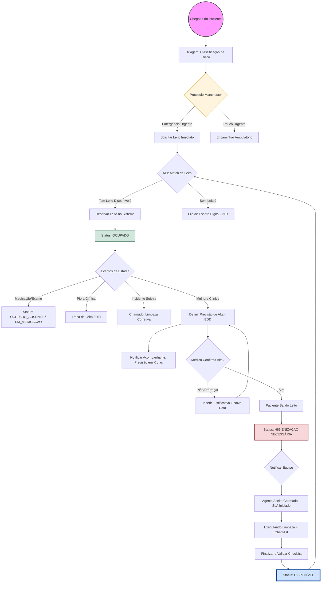

```mermaid
graph TD
    %% Início do Processo
    Start((Chegada do Paciente)) --> Triagem[Triagem: Classificação de Risco]
    Triagem --> Manchester{Protocolo Manchester}
    
    %% Decisão de Internação
    Manchester -- Emergência/Urgente --> SolicitaLeito[Solicitar Leito Imediato]
    Manchester -- Pouco Urgente --> Ambulatorio[Encaminhar Ambulatório]
    
    %% Alocação via API
    SolicitaLeito --> API_Match{API: Match de Leito}
    API_Match -- Tem Leito Disponível? --> Reservar[Reservar Leito no Sistema]
    API_Match -- Sem Leito? --> FilaEspera[Fila de Espera Digital - NIR]
    
    %% Estadia e Eventos
    Reservar --> Internado[Status: OCUPADO]
    Internado --> Eventos{Eventos de Estadia}
    
    Eventos -- Medicação/Exame --> BloqueioTemp[Status: OCUPADO_AUSENTE / EM_MEDICACAO]
    Eventos -- Piora Clínica --> Remanejamento[Troca de Leito / UTI]
    Eventos -- Incidente Sujeira --> LimpezaEmergencia[Chamado: Limpeza Corretiva]
    
    %% O Processo de Alta (O Core do Projeto)
    Eventos -- Melhora Clínica --> PrevisaoAlta[Definir Previsão de Alta - EDD]
    PrevisaoAlta --> NotificaAcomp[Notificar Acompanhante: 'Previsão em X dias']
    
    PrevisaoAlta --> ConfirmarAlta{Médico Confirma Alta?}
    ConfirmarAlta -- Não/Prorrogar --> Justificativa[Inserir Justificativa + Nova Data]
    Justificativa --> PrevisaoAlta
    
    ConfirmarAlta -- Sim --> LiberaPaciente[Paciente Sai do Leito]
    
    %% Giro de Leito (Logística)
    LiberaPaciente --> Higienizacao[Status: HIGIENIZAÇÃO NECESSÁRIA]
    Higienizacao --> NotificaLimpeza{Notificar Equipe}
    
    NotificaLimpeza --> Aceite[Agente Aceita Chamado - SLA Iniciado]
    Aceite --> Execucao[Executando Limpeza + Checklist]
    Execucao --> Finalizado[Finalizar e Validar Checklist]
    
    Finalizado --> Disponivel[Status: DISPONÍVEL]
    Disponivel --> API_Match
    
    %% Estilização
    style Start fill:#f9f,stroke:#333,stroke-width:2px
    style Manchester fill:#fff4dd,stroke:#d4a017,stroke-width:2px
    style Internado fill:#d1e7dd,stroke:#0f5132,stroke-width:2px
    style Higienizacao fill:#f8d7da,stroke:#842029,stroke-width:2px
    style Disponivel fill:#cfe2ff,stroke:#084298,stroke-width:4px
``` 