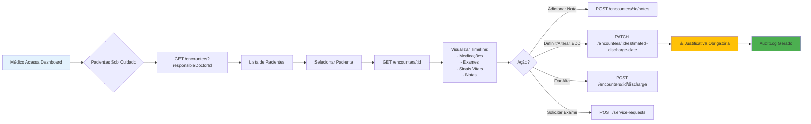
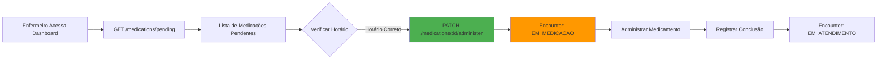

# 🏥 Diagrama de Fluxo - Sistema de Gestão de Leitos
## Versão 2.0 - Atualizado com Implementações Reais

## Fluxo Principal: Jornada do Paciente

```mermaid
graph TD
    %% Início do Processo
    Start((Chegada do Paciente)) --> CheckCadastro{Paciente Cadastrado?}
    CheckCadastro -- Sim --> BuscarPaciente[Buscar por CPF]
    CheckCadastro -- Não --> CriarPaciente[Criar Novo Paciente]
    
    BuscarPaciente --> Triagem
    CriarPaciente --> Triagem[Triagem: POST /triagem/realizar]
    
    Triagem --> Manchester{Protocolo Manchester<br/>Classificação de Risco}
    
    %% Decisão baseada no Manchester
    Manchester -- 🔴 VERMELHO/LARANJA --> PrioridadeAlta[Prioridade Máxima]
    Manchester -- 🟡 AMARELO --> PrioridadeMédia[Prioridade Média]
    Manchester -- 🟢 VERDE --> PrioridadeBaixa[Prioridade Baixa]
    Manchester -- 🔵 AZUL --> ConsultaAmbulatorial[Ambulatório]
    
    %% Fluxo de Prioridades
    PrioridadeAlta --> AlgoritmoMatch
    PrioridadeMédia --> AlgoritmoMatch
    PrioridadaBaixa --> AlgoritmoMatch
    
    %% Algoritmo de Match de Leito
    AlgoritmoMatch[Algoritmo de Match Automático<br/>Busca por: Especialidade + Disponibilidade]
    AlgoritmoMatch --> TemLeito{Leito Disponível?}
    
    %% Se tem leito disponível
    TemLeito -- Sim --> ReservaAutomatica[Reservar Leito Automaticamente<br/>Status: OCUPADO]
    ReservaAutomatica --> CriarEncounter[Criar Encounter<br/>Status: EM_ATENDIMENTO]
    CriarEncounter --> Internado[✅ Paciente Internado]
    
    %% Se não tem leito disponível
    TemLeito -- Não --> FilaEspera[Fila de Espera Digital NIR<br/>GET /triagem/fila-espera<br/>Ordenada por Prioridade Manchester]
    FilaEspera --> MonitorarFila[Sistema Monitora<br/>Novos Leitos Disponíveis]
    MonitorarFila --> NotificarTriagem[Notificar Equipe de Triagem]
    NotificarTriagem --> AlocacaoManual[Alocação Manual<br/>PUT /triagem/alocar/:encounterId/:locationId]
    AlocacaoManual --> Internado
    
    %% Estadia e Eventos
    Internado --> Eventos{Eventos Durante a Internação}
    
    %% Medicação
    Eventos -- Medicação --> RegistrarMed[POST /medications<br/>Status: PLANEJADO]
    RegistrarMed --> AdministrarMed[PATCH /medications/:id/administer<br/>Status: EM_ANDAMENTO]
    AdministrarMed --> BloqueioTemp[Encounter Status: EM_MEDICACAO<br/>🚫 Bloqueio de Transporte]
    BloqueioTemp --> ConcluirMed[Status: CONCLUIDO]
    ConcluirMed --> VoltarAtendimento[Status: EM_ATENDIMENTO]
    
    %% Exame
    Eventos -- Exame Externo --> SolicitarExame[POST /service-requests<br/>Status: SOLICITADO]
    SolicitarExame --> AgendarExame[PATCH /service-requests/:id<br/>Status: AGENDADO]
    AgendarExame --> TransporteExame[Status: EM_ANDAMENTO<br/>Location: OCUPADO_AUSENTE]
    TransporteExame --> RealizarExame[Exame Realizado]
    RealizarExame --> RetornoPaciente[Paciente Retorna ao Leito<br/>Location: OCUPADO]
    RetornoPaciente --> RegistrarResultado[PATCH /service-requests/:id/result<br/>Status: CONCLUIDO]
    RegistrarResultado --> VoltarAtendimento
    
    %% Piora Clínica
    Eventos -- Piora Clínica --> AvaliarTransferencia{Necessita UTI/Outro Leito?}
    AvaliarTransferencia -- Sim --> BuscarNovoLeito[Buscar Leito Adequado]
    BuscarNovoLeito --> Remanejamento[Transferência de Leito<br/>Encounter: TRANSFERIDO]
    Remanejamento --> LiberarAnterior[Liberar Leito Anterior]
    LiberarAnterior --> NovoLeito[Alocar em Novo Leito]
    NovoLeito --> VoltarAtendimento
    
    %% Incidente de Limpeza
    Eventos -- Incidente Sujeira --> LimpezaEmergencia[POST /tasks<br/>type: LIMPEZA_EMERGENCIA<br/>priority: CRITICA]
    LimpezaEmergencia --> NotificarLimpeza[Notificar Equipe de Limpeza<br/>🚨 Fura Fila se UTI/Emergência]
    NotificarLimpeza --> AceiteLimpeza[Agente Aceita<br/>Status: ACEITA<br/>SLA Iniciado]
    AceiteLimpeza --> ExecutarLimpeza[Status: EM_ANDAMENTO<br/>Paciente Permanece no Leito]
    ExecutarLimpeza --> ConferirChecklist[Checklist de Limpeza]
    ConferirChecklist --> FinalizarEmergencia[Status: CONCLUIDA]
    FinalizarEmergencia --> VoltarAtendimento
    
    %% Melhora Clínica - O Core do Projeto
    Eventos -- Melhora Clínica --> DefineEDD[Médico Define Previsão de Alta EDD<br/>PATCH /encounters/:id/estimated-discharge-date<br/>✅ Justificativa Obrigatória<br/>✅ AuditLog Gerado]
    DefineEDD --> NotificarAcomp[Notificar Acompanhante<br/>'Previsão de Alta em X dias']
    
    DefineEDD --> MonitorarEDD[Sistema Monitora Data EDD]
    MonitorarEDD --> DataProxima{Data EDD Chegou?}
    
    DataProxima -- Não --> ContinuarInternacao[Continuar Internação]
    ContinuarInternacao --> VoltarAtendimento
    
    DataProxima -- Sim --> MedicoConfirma{Médico Confirma Alta?<br/>POST /encounters/:id/discharge}
    
    %% Prorrogação de Alta
    MedicoConfirma -- Não/Prorrogar --> Justificativa[⚠️ OBRIGATÓRIO: Inserir Justificativa<br/>Nova Data EDD<br/>✅ AuditLog: RN.05]
    Justificativa --> DefineEDD
    
    %% Alta Confirmada
    MedicoConfirma -- Sim --> ConfirmarAlta[Encounter Status: ALTA_CONFIRMADA]
    ConfirmarAlta --> PacienteSai[Paciente Sai do Leito<br/>Encounter: ALTA_REALIZADA]
    
    %% Giro de Leito - Logística
    PacienteSai --> MudarStatusLeito[Location Status:<br/>HIGIENIZACAO_NECESSARIA]
    MudarStatusLeito --> CriarTarefaLimpeza[POST /tasks<br/>type: LIMPEZA<br/>priority: baseada em specialty]
    
    CriarTarefaLimpeza --> VerificarPrioridade{Leito é UTI/Emergência?}
    VerificarPrioridade -- Sim --> PrioridadeCritica[priority: CRITICA<br/>🔴 Fura Fila RN.04]
    VerificarPrioridade -- Não --> PrioridadeNormal[priority: NORMAL]
    
    PrioridadeCritica --> NotificarEquipe
    PrioridadeNormal --> NotificarEquipe[GET /tasks/cleaning<br/>Equipe Visualiza Chamados]
    
    NotificarEquipe --> AgenteAceita[Agente Aceita Chamado<br/>PATCH /tasks/:id/assign<br/>Status: ACEITA<br/>⏱️ SLA Iniciado]
    
    AgenteAceita --> IniciarLimpeza[Status: EM_ANDAMENTO<br/>Location: HIGIENIZACAO_EM_ANDAMENTO<br/>startedAt registrado]
    
    IniciarLimpeza --> ExecutarChecklist[Executar Checklist:<br/>✅ Roupa de Cama<br/>✅ Desinfecção<br/>✅ Equipamentos<br/>✅ Banheiro]
    
    ExecutarChecklist --> ValidarChecklist{Todos os Itens<br/>Completos?}
    
    ValidarChecklist -- Não --> AlertaIncompleto[⚠️ Não pode finalizar<br/>Itens pendentes]
    AlertaIncompleto --> ExecutarChecklist
    
    ValidarChecklist -- Sim --> FinalizarLimpeza[POST /tasks/:id/complete<br/>Status: CONCLUIDA<br/>completedAt registrado]
    
    FinalizarLimpeza --> TentarLiberar[PATCH /locations/:id/status<br/>tentativa: DISPONIVEL]
    
    TentarLiberar --> VerificarRN02{RN.02: Checklist<br/>de Limpeza Completo?}
    
    %% Validação RN.02 - Trava de Limpeza
    VerificarRN02 -- Não --> BloquearLiberacao[❌ BLOQUEADO<br/>Erro: Checklist Incompleto]
    BloquearLiberacao --> ExecutarChecklist
    
    VerificarRN02 -- Sim --> LiberarLeito[✅ Location Status: DISPONIVEL<br/>Leito Pronto para Nova Internação]
    
    LiberarLeito --> AlgoritmoMatch
    
    %% Fluxo de Ambulatório
    ConsultaAmbulatorial --> Fim((Fim do Fluxo))
    
    VoltarAtendimento --> Eventos
    
    %% Estilização
    style Start fill:#f9f,stroke:#333,stroke-width:3px
    style Manchester fill:#fff4dd,stroke:#d4a017,stroke-width:2px
    style Internado fill:#d1e7dd,stroke:#0f5132,stroke-width:3px
    style FilaEspera fill:#fff3cd,stroke:#856404,stroke-width:2px
    style MudarStatusLeito fill:#f8d7da,stroke:#842029,stroke-width:2px
    style LiberarLeito fill:#cfe2ff,stroke:#084298,stroke-width:4px
    style Justificativa fill:#ffc107,stroke:#ff5722,stroke-width:3px
    style BloquearLiberacao fill:#dc3545,stroke:#000,stroke-width:3px
    style LimpezaEmergencia fill:#ff6b6b,stroke:#c92a2a,stroke-width:3px
    style DefineEDD fill:#a8dadc,stroke:#457b9d,stroke-width:2px
    style AlgoritmoMatch fill:#e9c46a,stroke:#f4a261,stroke-width:2px
```

---

## Fluxos Secundários

### Fluxo de Visita Médica

### Fluxo de Enfermagem

---

## Legenda de Status

### Status de Leitos (Location)
- 🟢 **DISPONIVEL**: Pronto para nova internação
- 🔵 **OCUPADO**: Paciente presente
- 🟡 **OCUPADO_AUSENTE**: Paciente em exame (volta)
- 🟠 **HIGIENIZACAO_NECESSARIA**: Aguardando limpeza
- 🟣 **HIGIENIZACAO_EM_ANDAMENTO**: Limpeza ativa
- ⚫ **MANUTENCAO**: Bloqueado por manutenção
- 🔴 **BLOQUEADO**: Indisponível administrativamente

### Status de Encounters
- 🔵 **EM_TRIAGEM**: Classificação inicial
- 🟡 **AGUARDANDO_LEITO**: Na fila (NIR)
- 🟢 **EM_ATENDIMENTO**: Internação normal
- 💊 **EM_MEDICACAO**: Recebendo medicamento
- 🏥 **EM_EXAME**: Paciente em procedimento
- 👨‍⚕️ **AGUARDANDO_VISITA**: Aguarda avaliação médica
- 📅 **PREVISAO_ALTA**: EDD definida
- ✅ **ALTA_CONFIRMADA**: Alta aprovada pelo médico
- 🚪 **ALTA_REALIZADA**: Paciente saiu
- 🔄 **TRANSFERIDO**: Mudou de leito
- ❌ **CANCELADO**: Internação cancelada

---

**Atualizado em**: 18 de março de 2026  
**Versão**: 2.0 - Reflete fluxos implementados no sistema 